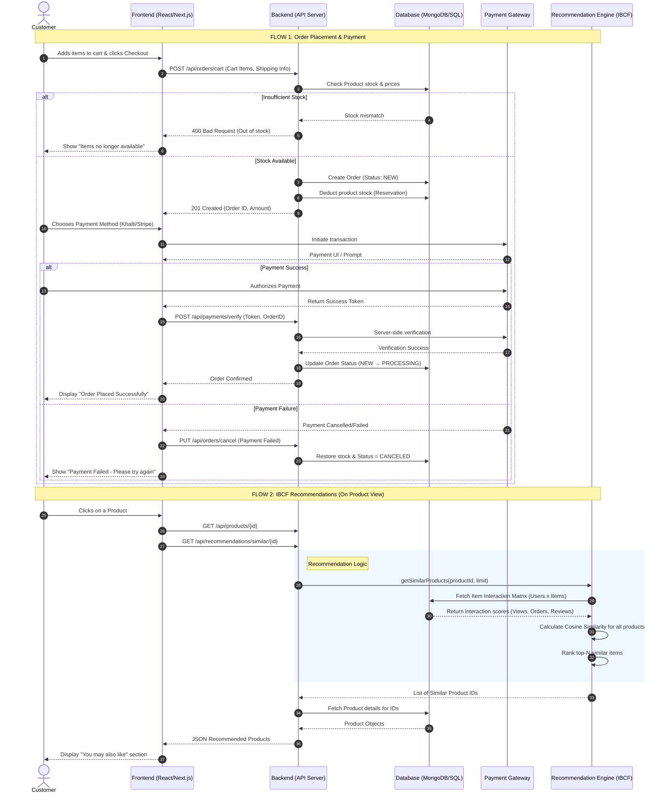

# 📊 eCommerce System: UML Sequence Diagram & Algorithms

This document provides a technical analysis of the **Jhapcham eCommerce System**, covering the core Order Placement workflow and the Item-Based Collaborative Filtering (IBCF) Recommendation Engine.

---

## PART 1 — UML Sequence Diagram

The following diagram illustrates the interaction between the Customer, Frontend, Backend, Database, Payment Gateway, and the Recommendation Engine.

---

## PART 2 — Algorithms

### A. Order Processing Algorithm

This algorithm ensures data consistency and inventory integrity during the checkout process.

**Algorithm:** `ProcessOrderCheckout`
**Input:** `CartItems`, `User`, `ShippingDetails`, `PaymentMethod`
**Output:** `OrderConfirmation` or `Error`

1.  **Validation Phase:**
    *   If `CartItems` is empty, return **Error**: "Cart is empty".
    *   For each `item` in `CartItems`:
        *   Retrieve `product` from Database.
        *   If `product.stock < item.quantity`, return **Error**: "Insufficient stock for {product.name}".
2.  **Calculation Phase:**
    *   `ItemsTotal = Σ (item.price * item.quantity)`
    *   `ShippingFee = CalculateShipping(ShippingDetails, productRules)`
    *   `GrandTotal = ItemsTotal + ShippingFee - Discounts`
3.  **Persistence Phase (Atomic Transaction):**
    *   Create new `Order` record with `Status = NEW`.
    *   Create `OrderItems` (Snapshot pattern: capture price/name at time of purchase).
    *   Update Inventory: `product.stock = product.stock - item.quantity`.
4.  **Payment Phase:**
    *   If `paymentMethod == COD`:
        *   Transition `Status = PROCESSING`.
        *   Clear User's Cart.
        *   Return **Success**.
    *   Else (Online Payment):
        *   Invoke External Gateway API (`initiatePayment`).
        *   Wait for `PaymentToken`.
        *   On `verifyToken` success:
            *   Update `Order.paymentStatus = PAID`.
            *   Transition `Status = PROCESSING`.
            *   Clear User's Cart.
        *   On Failure:
            *   Restore Inventory: `product.stock = product.stock + item.quantity`.
            *   Transition `Status = CANCELED`.
            *   Return **Error**: "Payment Verification Failed".

---

### B. Item-Based Collaborative Filtering (IBCF) Algorithm

This algorithm identifies similar items based on aggregated user behavior (interactions).

**Algorithm:** `GenerateSimilarItemsIBCF`
**Input:** `TargetProductID`, `K` (number of recommendations)
**Output:** `Top-K Similar Products`

1.  **Data Retrieval:**
    *   Query the `UserActivity` table for all interactions ($User, Product, Score$).
    *   *Scores:* Purchase = 5, Review = 4, AddToCart = 3, View = 1.
2.  **Matrix Construction:**
    *   Build an **Item-User Matrix** $M$ where $M[i][u]$ is the interaction score of User $u$ with Item $i$.
3.  **Preprocessing (Optimization):**
    *   For each item $i$, calculate its **Vector Norm**: $||V_i|| = \sqrt{\sum_{u \in Users} M[i][u]^2}$.
4.  **Similarity Computation:**
    *   Initialize an empty map `Similarities`.
    *   For each `CandidateItem` $j$ in database (where $j \neq$ `TargetProductID`):
        *   Identify users who interacted with **both** `TargetItem` $i$ and `CandidateItem` $j$.
        *   Calculate the **Dot Product**: $Dot(i, j) = \sum_{u \in SharedUsers} (M[i][u] \cdot M[j][u])$.
        *   Calculate **Cosine Similarity**: $S_{i,j} = \frac{Dot(i, j)}{||V_i|| \cdot ||V_j||}$.
        *   If $S_{i,j} >$ `Threshold` (e.g., 0.05), add $\{j: S_{i,j}\}$ to `Similarities`.
5.  **Ranking:**
    *   Sort `Similarities` by score in descending order.
    *   Select the top $K$ items.
6.  **Fallback Strategy:**
    *   If `Similarities.count < K`:
        *   Calculate `Remaining = K - Similarities.count`.
        *   Fetch top Global Popular items (highest views) not already in `Similarities`.
        *   Append them to the results.
7.  **Output:** Return list of product details for the selected IDs.

---

### C. Scalability Optimization Notes (Optional)
*   **Pre-computation:** Run the IBCF similarity matrix calculation offline (e.g., via a nightly Spark/Cron job) and store the top-50 similarities in a `ProductSimilarity` lookup table for $O(1)$ retrieval.
*   **Caching:** Store recommendation results in Redis with a TTL of 1 hour.
*   **Cold Start:** For new products with zero interactions, use **Content-Based Filtering** (matching tags/categories) as a bridge until interaction data is available.
