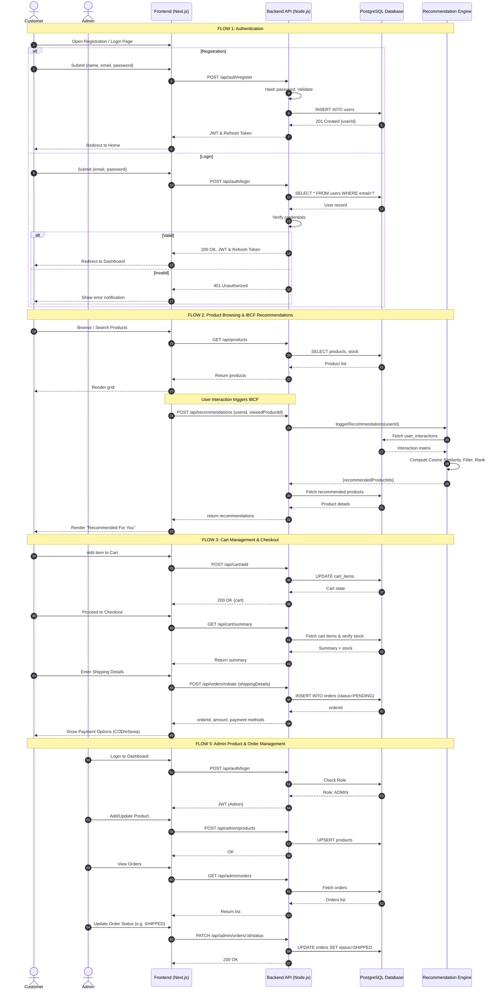

# Importing the Sequence Diagram into Draw.io

Because generating raw `.drawio` XML files directly from code produces heavily distorted visual layouts (since XML requires exact pixel X/Y coordinates for hundreds of boxes and lines), the easiest and cleanest way to get this into **draw.io** is using its built-in text-to-diagram engines (PlantUML or Mermaid). 

I have generated a **Mermaid** version of your sequence diagram for this purpose.

## Step-by-Step Instructions

1. Open [app.diagrams.net (draw.io)](https://app.diagrams.net/).
2. Create or open a blank diagram.
3. In the top toolbar, go to **Arrange** ➔ **Insert** ➔ **Advanced** ➔ **Mermaid...** (Depending on your Draw.io version, this might also be under the "+" icon in the top toolbar ➔ **Advanced** ➔ **Mermaid**).
4. **Copy the code block below** and paste it into the text box that appears.
5. Click **Insert**. Draw.io will instantly generate the sequence diagram and automatically apply a professional layout for you.

---

### Copy this code:

